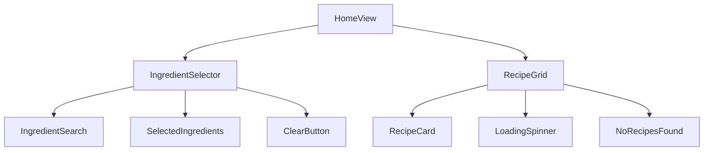

# Plan implementacji widoku Home

## 1. Przegląd
Widok Home jest głównym interfejsem aplikacji NaWinie, umożliwiającym użytkownikom wyszukiwanie przepisów na podstawie dostępnych składników. Widok składa się z dwóch głównych sekcji: interaktywnej listy składników oraz gridu z przepisami, które są dynamicznie filtrowane na podstawie wybranych składników.

## 2. Routing widoku
- **Ścieżka**: `/`
- **Layout**: `RootLayout`
- **Persystencja**: Lista składników przechowywana w URL jako query params

## 3. Struktura komponentów


## 4. Szczegóły komponentów

### HomeView
- **Opis**: Główny komponent widoku, zarządzający stanem i layoutem
- **Główne elementy**:
  - Container z max-width dla responsywności
  - Grid layout dla sekcji składników i przepisów
  - ErrorBoundary dla obsługi błędów
- **Obsługiwane interakcje**: Brak (kontener)
- **Obsługiwana walidacja**: Brak
- **Typy**:
  ```typescript
  interface HomeViewProps {
    initialIngredients?: string[]; // z URL
  }
  ```
- **Propsy**: Brak (komponent na poziomie strony)

### IngredientSelector
- **Opis**: Sekcja zarządzania składnikami
- **Główne elementy**:
  - Input wyszukiwania z autouzupełnianiem
  - Lista wybranych składników
  - Przycisk czyszczenia
- **Obsługiwane interakcje**:
  - Dodawanie składnika
  - Usuwanie składnika
  - Czyszczenie listy
- **Obsługiwana walidacja**:
  - Unikalne składniki
  - Maksymalnie 10 składników
- **Typy**:
  ```typescript
  interface IngredientSelectorProps {
    selectedIngredients: IngredientDto[];
    onIngredientAdd: (ingredient: IngredientDto) => void;
    onIngredientRemove: (ingredientId: string) => void;
    onClear: () => void;
  }
  ```

### IngredientSearch
- **Opis**: Komponent wyszukiwania składników z autouzupełnianiem
- **Główne elementy**:
  - Input z Combobox z shadcn/ui
  - Lista podpowiedzi
  - Ikona ładowania
- **Obsługiwane interakcje**:
  - Wpisywanie tekstu
  - Wybór z listy
  - Zatwierdzenie enterem
- **Obsługiwana walidacja**:
  - Minimalna długość zapytania (2 znaki)
  - Debouncing (300ms)
- **Typy**:
  ```typescript
  interface IngredientSearchProps {
    onSelect: (ingredient: IngredientDto) => void;
    disabled?: boolean;
  }
  ```

### SelectedIngredients
- **Opis**: Lista wybranych składników
- **Główne elementy**:
  - Lista tagów/pillów
  - Przyciski usuwania
- **Obsługiwane interakcje**:
  - Usuwanie składnika
- **Obsługiwana walidacja**: Brak
- **Typy**:
  ```typescript
  interface SelectedIngredientsProps {
    ingredients: IngredientDto[];
    onRemove: (ingredientId: string) => void;
  }
  ```

### RecipeGrid
- **Opis**: Grid przepisów z infinite scroll
- **Główne elementy**:
  - Grid responsywny
  - Karty przepisów
  - Loader
  - Komunikat braku wyników
- **Obsługiwane interakcje**:
  - Infinite scroll
  - Kliknięcie w przepis
- **Obsługiwana walidacja**: Brak
- **Typy**:
  ```typescript
  interface RecipeGridProps {
    ingredientIds: string[];
    isLoading: boolean;
  }
  ```

### RecipeCard
- **Opis**: Karta pojedynczego przepisu
- **Główne elementy**:
  - Zdjęcie
  - Tytuł
  - Ocena
  - Czas przygotowania
- **Obsługiwane interakcje**:
  - Kliknięcie (przekierowanie)
- **Obsługiwana walidacja**: Brak
- **Typy**:
  ```typescript
  interface RecipeCardProps {
    recipe: RecipeListItemDto;
  }
  ```

## 5. Typy
```typescript
// Nowe typy
interface HomeViewState {
  selectedIngredients: IngredientDto[];
  isLoading: boolean;
  error: Error | null;
}

interface UseIngredientsSearchResult {
  suggestions: IngredientDto[];
  isLoading: boolean;
  error: Error | null;
  search: (query: string) => Promise<void>;
}

interface UseRecipeSearchResult {
  recipes: RecipeListItemDto[];
  isLoading: boolean;
  error: Error | null;
  hasMore: boolean;
  loadMore: () => Promise<void>;
}
```

## 6. Zarządzanie stanem

### Custom Hooks

#### useIngredientsSearch
```typescript
const useIngredientsSearch = () => {
  // Stan dla wyszukiwania składników
  // Obsługa debouncing
  // Wywołania API /ingredients z parametrem search
}
```

#### useRecipeSearch
```typescript
const useRecipeSearch = (ingredientIds: string[]) => {
  // Stan dla infinite scroll
  // Wywołania API /recipes/find-by-ingredients
  // Zarządzanie paginacją
}
```

#### useUrlIngredients
```typescript
const useUrlIngredients = () => {
  // Synchronizacja wybranych składników z URL
  // Parsowanie i aktualizacja query params
}
```

## 7. Integracja API

### Endpoints
- GET `/ingredients` - wyszukiwanie składników
  - Query params: `search`, `page`, `limit`
  - Response: `PaginatedIngredientsDto`

- GET `/recipes/find-by-ingredients` - wyszukiwanie przepisów
  - Query params: `ingredientIds`, `page`, `limit`
  - Response: `PaginatedRecipesDto`

### Obsługa błędów
- Timeout po 5 sekundach
- Retry dla błędów sieciowych (max 3 próby)
- Toast dla błędów krytycznych

## 8. Interakcje użytkownika
1. Wyszukiwanie składników:
   - Wpisanie min. 2 znaków rozpoczyna wyszukiwanie
   - Debouncing 300ms
   - Autouzupełnianie z listy sugestii
   - Możliwość nawigacji strzałkami

2. Zarządzanie listą składników:
   - Dodawanie przez enter lub kliknięcie
   - Usuwanie pojedynczo lub wszystkie
   - Limit 10 składników
   - Animacje przy dodawaniu/usuwaniu

3. Przeglądanie przepisów:
   - Automatyczne odświeżanie przy zmianie składników
   - Infinite scroll
   - Skeleton loading
   - Kliknięcie przekierowuje do szczegółów

## 9. Warunki i walidacja
1. Wyszukiwanie składników:
   - Min. 2 znaki
   - Max. 100 znaków
   - Debouncing 300ms

2. Lista składników:
   - Max. 10 składników
   - Brak duplikatów
   - Persystencja w URL

3. Grid przepisów:
   - Paginacja (10 przepisów)
   - Próg infinite scroll (300px)
   - Skeleton podczas ładowania

## 10. Obsługa błędów
1. Błędy API:
   - Toast z komunikatem
   - Retry dla błędów sieciowych
   - Fallback UI dla błędów krytycznych

2. Walidacja:
   - Inline feedback
   - Blokada akcji
   - Komunikaty pomocnicze

3. Stan pusty:
   - Komunikat dla braku wyników
   - Sugestie alternatywne
   - Przycisk reset

## 11. Kroki implementacji
1. Konfiguracja projektu:
   - Setup routingu
   - Konfiguracja shadcn/ui
   - Setup Tailwind

2. Implementacja komponentów:
   - HomeView (layout)
   - IngredientSelector
   - RecipeGrid

3. Integracja API:
   - Setup klienta HTTP
   - Implementacja hooks
   - Obsługa błędów

4. Implementacja logiki:
   - Zarządzanie stanem
   - URL sync
   - Infinite scroll

5. UI/UX:
   - Responsywność
   - Animacje
   - Loading states

6. Testy:
   - Unit testy hooks
   - Integracyjne testy komponentów
   - E2E testy kluczowych ścieżek

7. Optymalizacja:
   - Code splitting
   - Memoizacja
   - Prefetching 